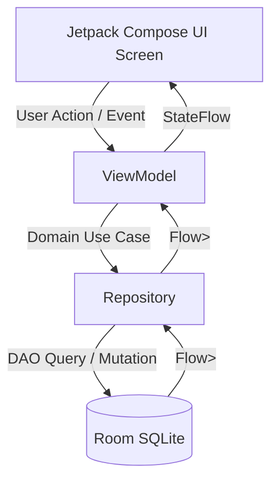
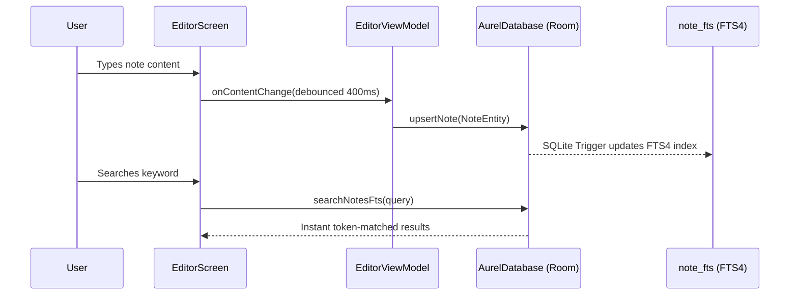

# Aurel Architecture & Data Flow Diagrams

## 1. Unidirectional Data Flow (UDF)

```mermaid
graph TD
    UI[Jetpack Compose UI Screen] -->|User Action / Event| VM[ViewModel]
    VM -->|Domain Use Case| Repo[Repository]
    Repo -->|DAO Query / Mutation| Room[(Room SQLite)]
    Room -->|Flow<List<Entity>>| Repo
    Repo -->|Flow<List<DomainModel>>| VM
    VM -->|StateFlow<UiState>| UI
```

## 2. Note Lifecycle & FTS4 Search Engine

```mermaid
sequenceDiagram
    participant User
    participant Editor as EditorScreen
    participant VM as EditorViewModel
    participant DB as AurelDatabase (Room)
    participant FTS as note_fts (FTS4)

    User->>Editor: Types note content
    Editor->>VM: onContentChange(debounced 400ms)
    VM->>DB: upsertNote(NoteEntity)
    DB-->>FTS: SQLite Trigger updates FTS4 index
    User->>Editor: Searches keyword
    Editor->>DB: searchNotesFts(query)
    DB-->>Editor: Instant token-matched results
```
